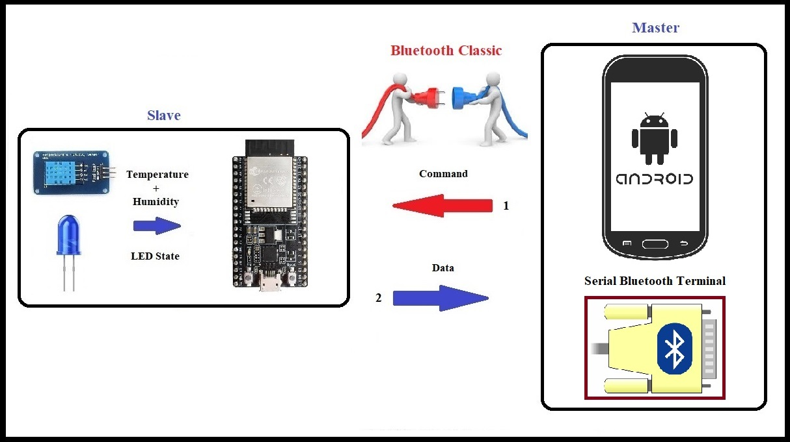

# ESP32-BT-TempRelay

This project implements a Bluetooth-based temperature and humidity monitoring system with relay control using an ESP32 microcontroller. It utilizes a DHT11 sensor for environmental 
measurements and allows remote control of a relay through Bluetooth commands.

## Features

- Bluetooth communication
- Temperature and humidity monitoring using DHT11 sensor
- Remote relay control via Bluetooth
- Periodic sensor data transmission
- PIN-based Bluetooth security

## Hardware Requirements

- ESP32 development board
- DHT11 temperature and humidity sensor
- Relay module
- Appropriate power supply

## Software Dependencies

- Arduino IDE
- ESP32 board support for Arduino
- BluetoothSerial library
- DHT sensor library

## Installation

1. Install the Arduino IDE and ESP32 board support.
2. Install the required libraries:
   - BluetoothSerial (comes with ESP32 board support)
   - DHT sensor library
3. Clone this repository or download the source code.
4. Open the `.ino` file in Arduino IDE.

## Configuration

- Set the Bluetooth device name in `SerialBT.begin("MyESP32")`.
- Modify the PIN code in `char *pin = "6622"` if desired.
- Configure the DHT sensor pin in `#define DHTPIN 4`.
- Set the relay control pin in `int pinRelay = 5`.
- Adjust the data sending interval in `const long interval = 5000`.

## Usage

1. Upload the code to your ESP32.
2. Power on the device.
3. Pair your Bluetooth-enabled device (e.g., smartphone) with the ESP32 using the PIN code.
4. Once connected, the ESP32 will start sending temperature and humidity data every 5 seconds.
5. Send "Relay_on" or "Relay_off" from your Bluetooth device to control the relay.

## Bluetooth Commands

- `Relay_on`: Turn on the relay
- `Relay_off`: Turn off the relay

## Serial Monitor

The device also prints all Bluetooth communication to the Serial Monitor, allowing for easy debugging and monitoring.

## Contributing

Contributions to improve the project are welcome. Please feel free to submit a Pull Request.

## License

This project is open-source and available under the [MIT License](LICENSE).
<h2 id="donation">Donation</h2>

If you find this project helpful, consider making a donation:

